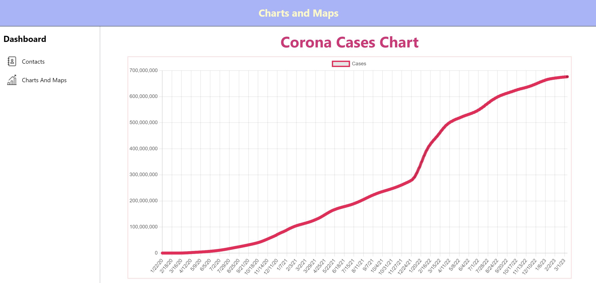

# Contact Page App with Charts and Maps
This is a contact page app built using ReactJS, JavaScript, TailwindCSS, React Router v6, and Redux. The app includes a dashboard with charts and maps that display COVID-19 data for different countries.

# Deployed Link : -

(https://abhaylodhi24.github.io/contact-page-app/)

# Pages and Functionality

The app has two main pages:

# Contacts

This page allows you to manage your contacts. You can add a new contact by filling out the form, and the contact will be added to the list. You can also edit or delete an existing contact. Clicking on a contact's name will take you to the contact details page.

# Charts and Maps
---
This page displays COVID-19 data for different countries. It includes a line graph showing the cases fluctuations over time and a map with markers that indicate the country name, total number of active, recovered cases, and deaths in that particular country as a popup.

# APIs Used
---
* World wide data of cases: (https://disease.sh/v3/covid-19/all)
* Country Specific data of cases: (https://disease.sh/v3/covid-19/countries)
* Graph data for cases with date: (https://disease.sh/v3/covid-19/historical/all?lastdays=all)

# Technologies Used

The following technologies were used to build this app:
* ReactJS
* JavaScript
* TailwindCSS
* React Router v6
* React Query
* Redux

# Installation and Setup

To run this app, follow these steps:

* Clone this repository: git clone (https://github.com/your-username/contact-page-app.git)
* Install the dependencies: npm install
* Start the app: npm start
* The app should open in your default browser at (http://localhost:3000/).

# Screenshots

## Contact Page:-

## Charts and Maps Page 

